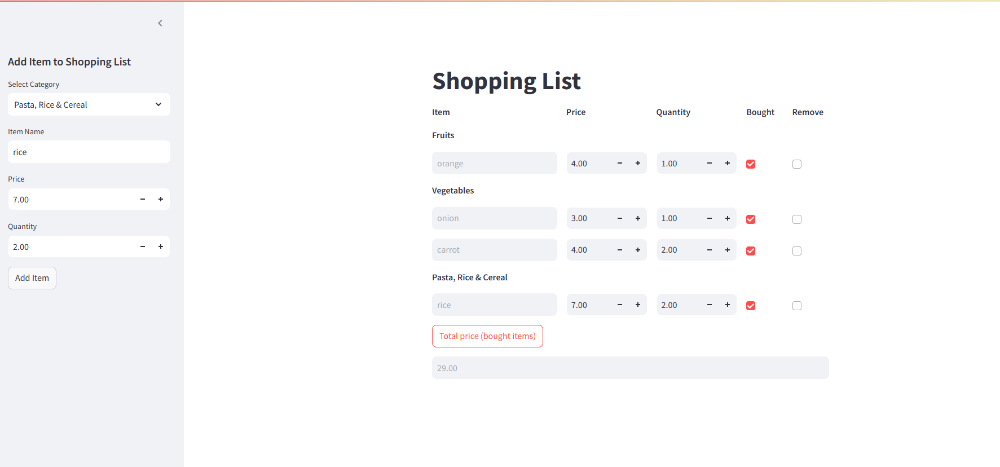

# Shopping list Application

This project is a web-based application which provides a user interface built with Streamlit to add new items and calculate the total price.

---

## Features

- **Frontend**: Built with Streamlit to allow users to:
  - Add/remove shopping list items.
  - Update Price and Quantity
  - Show items by categories.
  - Calculate total price for the items marked as bought.
- **Database**: The interaction with MySQL database is done with SQLAlchemy for storing the list.

---
## App screenshot




---

## Requirements

- Python 3.9 or later
- MySQL database
- Environment variables for database credentials:
  - `MYSQL_USERNAME`
  - `MYSQL_PASSWORD`

---

## Installation and Usage

1. Clone the repository:
   ```bash
   git clone https://github.com/elenab01234/Shopping_list.git
   cd Shopping_list
   pip install -r requirements.txt

2. In MySQL create the database shoppinglistdata using the following query:
    ```mySQL
   CREATE DATABASE shoppinglistdata

3. Start the streamlit server:
    ```bash
    cd src
    streamlit run main.py
